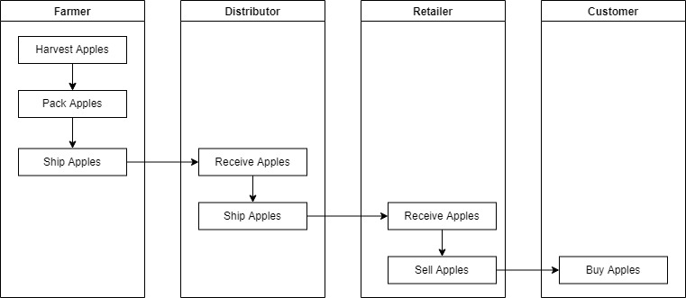
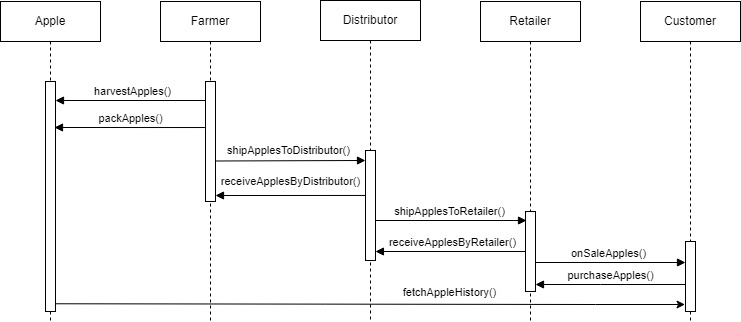
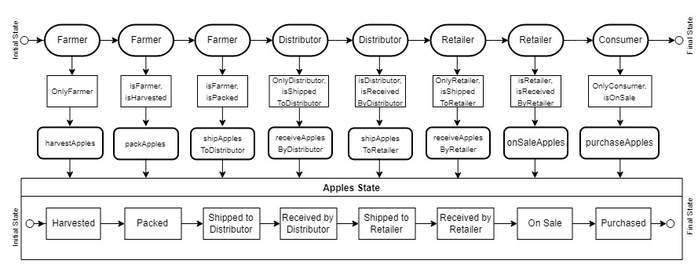
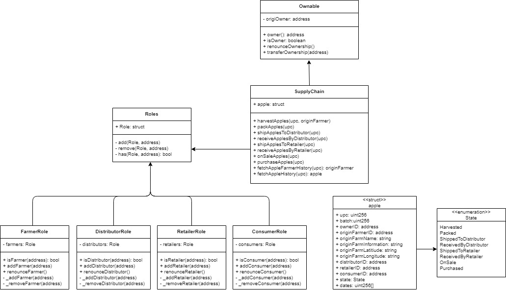
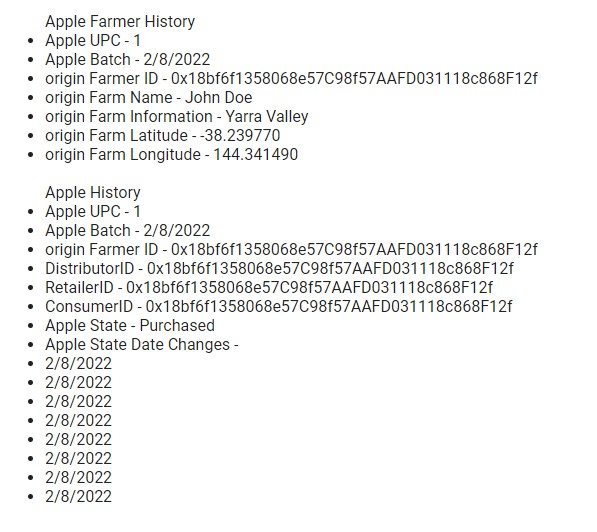

# PROJECT: Ethereum Dapp for Tracking Items through Supply Chain

- For this project, you will creating a DApp supply chain solution backed by the Ethereum platform. You will architect smart contracts that manage specific user permission controls as well as contracts that track and verify a product’s authenticity.
  
- In this project, I created a DApp - Organic Apples Supply Chain Solution to track and verify the authenticity of these organic apples from the farmers to the consumers.

## Requirement 1: Project Write-Up - UML
------------------------------------------------------------------------

Below are the UML diagrams that I created for this Organic Apples Supply Chain Solution.

### Activity Diagram
 

 
### Sequence Diagram
 

 
### State Diagram
 

 
### Class Diagram
 

 

## Requirement 2: Project Write-Up - Libraries
--------------------------------------------------------------

- The libraries used in this project are:

| Truffle | Solidity | Node.js |
|:---:|:---:|:---:|
| v5.4.28 | v0.8.11 | v16.13.1 |

 

| @truffle/hdwallet-provider | truffle-assertions | webpack-dev-server | Web3 | 
|:---:|:---:|:---:|:---:|
| v2.0.3 | v0.9.2 | v3.1.14 | v1.6.1 |

 

- @truffle/hdwallet-provider: HD Wallet-enabled Web3 provider to sign transactions on the Rinkeby network.
  
- truffle-assertions: Additional assertions that can be used to test Ethereum smart contracts inside Truffle tests.
  
- webpack-dev-server: A development web server that provide load reloading.
  
- web3: A collection of libraries that allows interact with an Ethereum node.
 

## Requirement 3: Project Write-Up - IPFS
--------------------------------------------------------------

- IPFS was not used in this project.

 

## Requirement 4: Project Write-Up - General
--------------------------------------------------------------  

### Note
- For testing the front-end website with the contract in the Rinkeby Network, please replace the Current Owner ID to 0x18bf6f1358068e57C98f57AAFD031118c868F12f before adding your farmer ID, distributor ID, retailer ID and consumer ID.
  
- For testing the front-end website with the contract in your truffle development network, please replace the Current Owner ID to your account[0]

### Contract Address
- To deploy the contract to the Rinkeby Network using Truffle: truffle migrate --network rinkeby
  
- The deployed contract address on the Rinkeby Network: 0x213d063a71BC05D0dCAF054417788Efe969305D4
  
- The deployed contract hash on the Rinkeby Network: 0x63b8c59eadc91df272c6de069562f5781668e9da17c08b91a2e5f65a59e84cb5

### Transaction Hash

- addFarmer: 0xed829d587786e79d94d6e6dd8ebccae691ccafb67654381446778ebcdfe91db3
- addDistributor: 0x00223d225c60b4f121e1262d27cbb1536a16f19c2017fc6cf9d7a3f84400b3f6
- addRetailer: 0x87d7156775c2339512f45c469f40dc4c88647c5bf889510ee71cb08282cb38f9
- addConsumer: 0x53402df8920ee591fe4358fc4d624d8390b8865ec0c0355fc9058a148bbc3021
- harvestApples: 0x47ca6283e7a43ca6fc8c2632155e7d9f357d6ee7e32cd761069f7196b822a7c1
- packApples: 0x63cf40c29f1073d9e3c8fc55ad69ec6ba85277ce0c9299d2fa42144c9696569c
- shipApplesToDistributor:0xf79c5e449a897ff7655b893e80f96abed48f8e1a335b01103b775eef2972e537
- receiveApplesByDistributor:133
- shipApplesToRetailer:123
- receiveApplesByRetailer:123
- onSaleApples:123
- purchaseApples:123
- fetchAppleFarmerHistory:123
- fetchAppleHistory:123

### Transaction History

- An example of the transaction history of the orgainic apple from the farmer to the consumer is as shown below.

