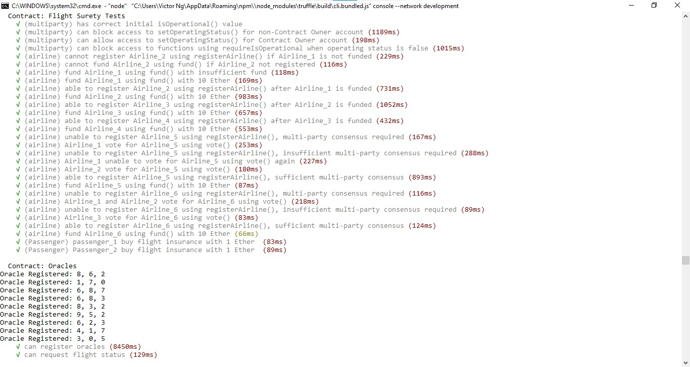
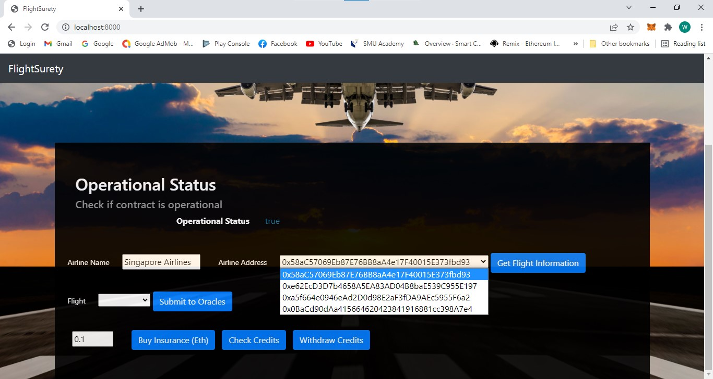
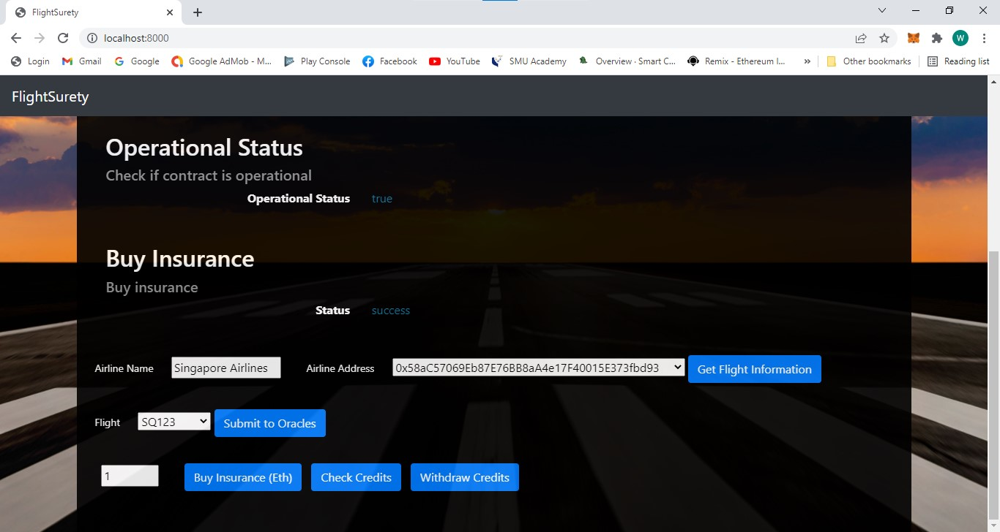
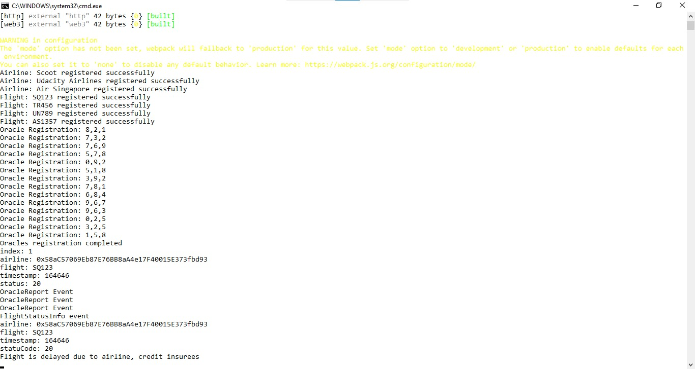
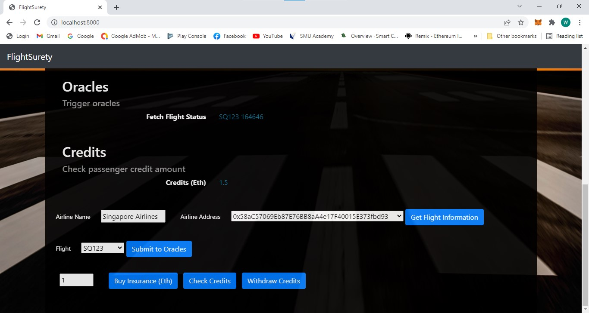
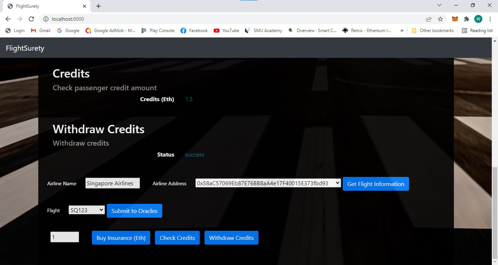

# FlightSurety

- For this project, I have created a FlightSurety DApp application project. The Dappsimplementation allows the passengers to choose from a fixed list of Airlines and their flight numbers and purchase the flight insurance. The flight information is provided by Oracles. If the flight is delayed due to airline fault, passengers will receive credit of 1.5 times the amount they paid. Passenger can then withdraw the credits for the insurance payout.
  
- The DApp is splitted into 3 different parts. 
1) The data smart contract for data persistence and app smart contract for app logic and oracles code. 
2) The UI implementation on the client. 
3) The Oracle functionality implemented in the server app.
  
Below are the screenshots that I created for this FlightSurety Dapp.

### Truffle Test
 

 
### Passenger choose from a fixed list of Airlines
 

 
### Passenger purchase flight insurance
 

 
### Oracles Server Log
 

 
### Passenger checks their credits after payout
 

 
### Passenger withdraw their credits
 

 

## Install

This repository contains Smart Contract code in Solidity (using Truffle), tests (also using Truffle), dApp scaffolding (using HTML, CSS and JS) and server app scaffolding.

To install, download or clone the repo, then:

`npm install`
`truffle compile`

## Develop Client

To run truffle tests:

`truffle test ./test/flightSurety.js`
`truffle test ./test/oracles.js`

To use the dapp:

`truffle migrate`
`npm run dapp`

To view dapp:

`http://localhost:8000`

## Develop Server

`npm run server`
`truffle test ./test/oracles.js`

## Deploy

To build dapp for prod:
`npm run dapp:prod`

Deploy the contents of the ./dapp folder

## Resources

* [How does Ethereum work anyway?](https://medium.com/@preethikasireddy/how-does-ethereum-work-anyway-22d1df506369)
* [BIP39 Mnemonic Generator](https://iancoleman.io/bip39/)
* [Truffle Framework](http://truffleframework.com/)
* [Ganache Local Blockchain](http://truffleframework.com/ganache/)
* [Remix Solidity IDE](https://remix.ethereum.org/)
* [Solidity Language Reference](http://solidity.readthedocs.io/en/v0.4.24/)
* [Ethereum Blockchain Explorer](https://etherscan.io/)
* [Web3Js Reference](https://github.com/ethereum/wiki/wiki/JavaScript-API)